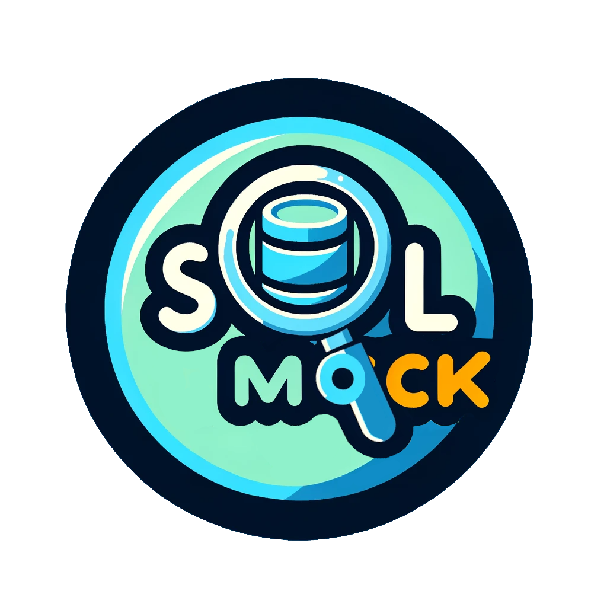

# SQL Mock: Python Library for Mocking SQL Queries with Dictionary Inputs

[](https://pypi.org/project/sql-mock/)
[](https://pypi.org/project/sql-mock/)
[](https://github.com/DeepLcom/sql-mock/blob/main/LICENSE)

The primary purpose of this library is to simplify the testing of SQL data models and queries by allowing users to mock input data and create tests for various scenarios. It provides a consistent and convenient way to test the execution of your query without the need to process a massive amount of data.

# Documentation

A full documentation can be found [on the documentation page](https://deeplcom.github.io/sql-mock/)

The library currently supports the following databases.
* BigQuery
* Clickhouse
* Redshift
* Snowflake

## Installation

The library can be installed from [PyPI](https://pypi.org/project/sql-mock/) using pip:

```shell
# BigQuery
pip install --upgrade "sql-mock[bigquery]"

# Clickhouse
pip install --upgrade "sql-mock[clickhouse]"

# Redshift
pip install --upgrade "sql-mock[redshift]"

# Snowflake
pip install --upgrade "sql-mock[snowflake]"
```

If you need to modify this source code, install the dependencies using poetry:

```shell
poetry install --all-extras
```

## Pydantic V1 vs. V2

SQL Mock's published version supports Pydantic V2. You might run into issues when your code depends on Pydantic V1.
We have an alternative branch you can install from that supports Pydantic V1 in the meanwhile: https://github.com/DeepLcom/sql-mock/tree/pydantic-v1


## Contributing

We welcome contributions to improve and enhance this open-source project. Whether you want to report issues, suggest new features, or directly contribute to the codebase, your input is valuable. To ensure a smooth and collaborative experience for both contributors and maintainers, please follow these guidelines:

### Reporting Issues

If you encounter a bug, have a feature request, or face any issues with the project, we encourage you to report them using the project's issue tracker. When creating an issue, please include the following information:

- A clear and descriptive title.
- A detailed description of the problem or suggestion.
- Steps to reproduce the issue (if applicable).
- Any error messages or screenshots that help clarify the problem.

### Feature Requests

If you have ideas for new features or improvements, please use the project's issue tracker to submit a feature request. We appreciate well-documented feature requests that explain the motivation and potential use cases.

### Contributing Code

Find more about contributing code in the [Contribution Guidelines](./CONTRIBUTION.md)

## Experimental

### SQL Mock Buddy - A custom (Chat) GPT to support you

We ran a small experiment to create a custom GPT for SQL Mock.
The SQL Mock Buddy can be accessed here: [https://chat.openai.com/g/g-FIXNcqu1l-sql-mock-buddy](https://chat.openai.com/g/g-FIXNcqu1l-sql-mock-buddy)

SQL Mock Buddy should help you to get started quickly with SQL Mock.

It is still in beta mode and you should definitely double-check its output!
